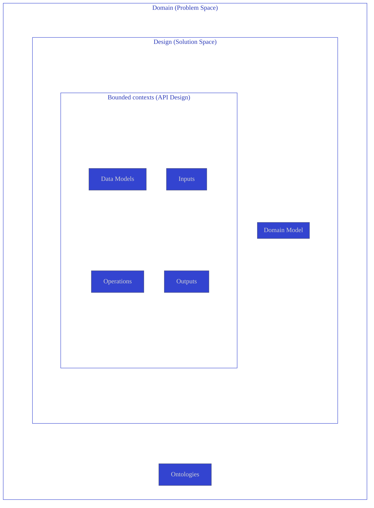
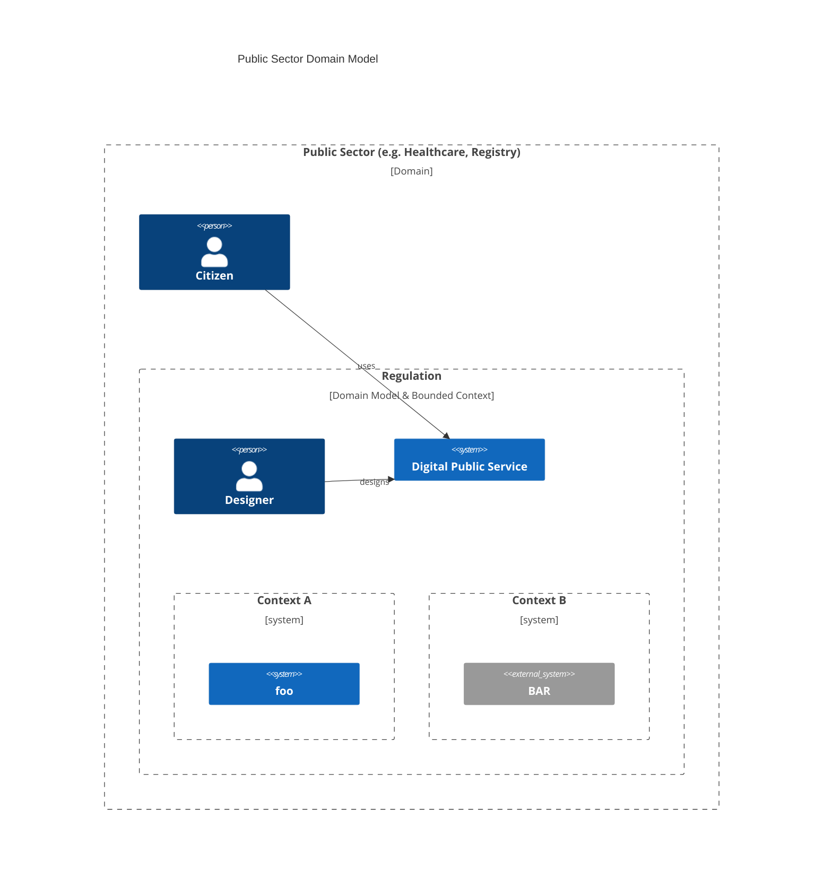

## DDD Flowchart Regulation

```mermaid

graph TD
%%{init: {"theme": "base", "themeVariables": { "primaryColor": "#3344d0", "primaryTextColor": "lightgray", "clusterBkg": "none", "tertiaryBorderColor": "#3344d0", "nodeTextColor": "white", "fontFamily": "Titillium"}}}%%

    classDef subgraph_padding fill:none, stroke:none
    classDef invisible_line stroke:none
    %% classDef default fill:#3344d0,stroke:#3344d0,color:#fff,clusterBkg:none
    classDef subgraph_italia fill:none,color:darkgray,stroke:#3344d0,stroke-width:2px

    subgraph DM [ Domain Model]
    end

    subgraph P2 ["Bounded contexts (API Design)"]
    subgraph Padder2 [ ]
        DataModel[Data Models] --- 
        Operations 
        Inputs ---
        Outputs
        %% Using linkStyle and --- links to display items as a square
        linkStyle 0 stroke:none
        linkStyle 1 stroke:none
    end
    end

    subgraph Sol["Design (Solution Space)"]
        subgraph Padder3 [ ]
        DM 
        P2
        end
    end
    subgraph Domain["Domain (Problem Space)"]
        Ontologies
        subgraph Padder1 [ ]
        Sol
        end
    end

    %%class P2 subgraph_italia
    %%class Domain subgraph_italia
    %% class Sol subgraph_italia
    %% Padders avoid overflows in subgraphs.
    class Padder1 subgraph_padding
    class Padder2 subgraph_padding
    class Padder3 subgraph_padding


```

## DDD Context Regulation

```mermaid
C4Context
  title Public Sector Domain Model

  Boundary(gov, "Public Sector (e.g. Healthcare, Registry)", "Domain") {
    Person(User, "Citizen")
    Boundary(regu, "Regulation", "Domain Model & Bounded Context"){
      Person(Designer, "Designer")
      System(impl, "Digital Public Service")
      Boundary(S1, "Context A") { 
        System(s1, "foo") 
      }
      Boundary(S2, "Context B") { 
        System_Ext(foo, "BAR") 
        }

    }
  }
  Rel(User, impl, "uses")
  Rel(Designer, impl, "designs")
  
```

