### Domain vs regulation

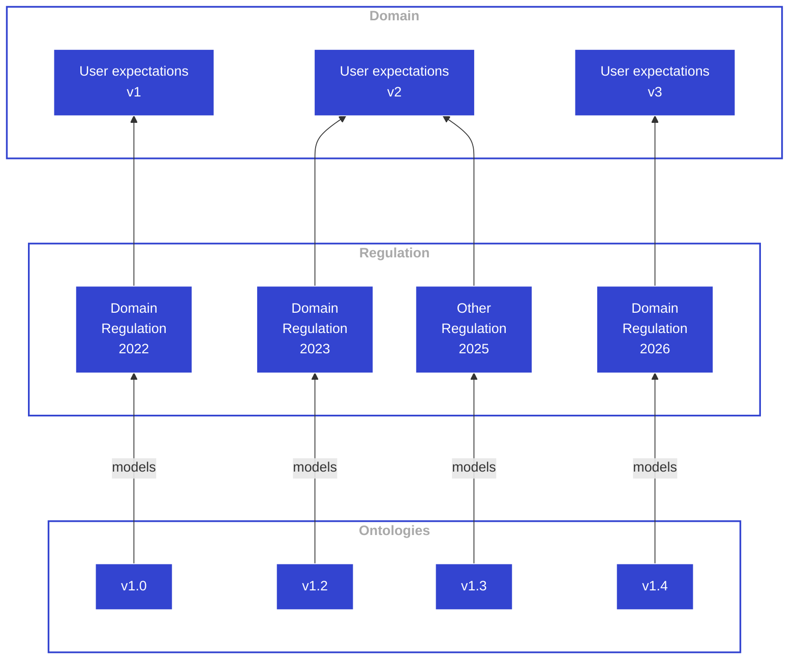

### Data semantics

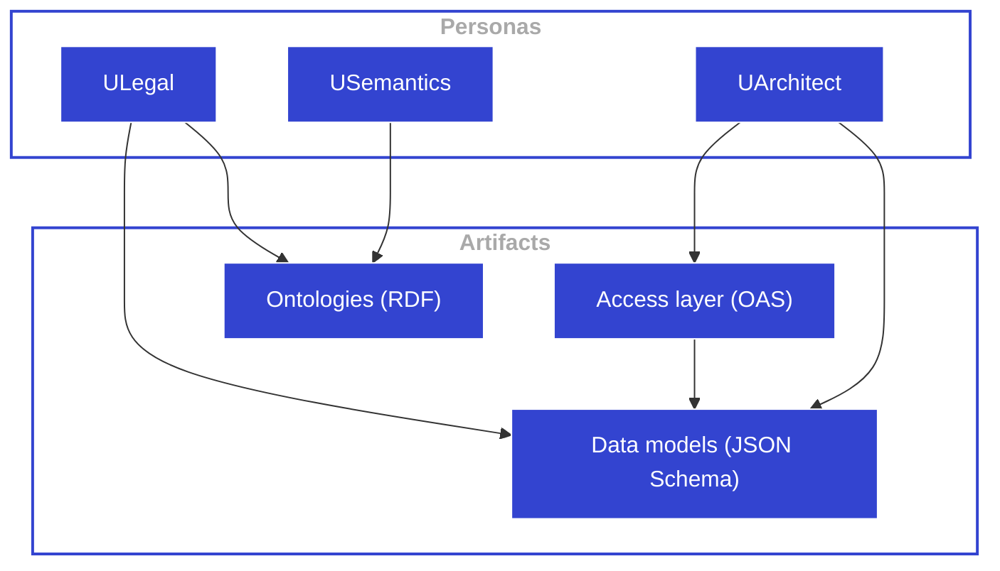

### Communicating Contexts

Connector pattern

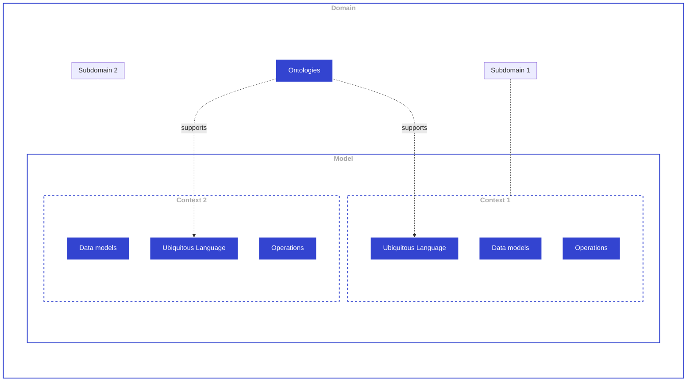

### Connector pattern

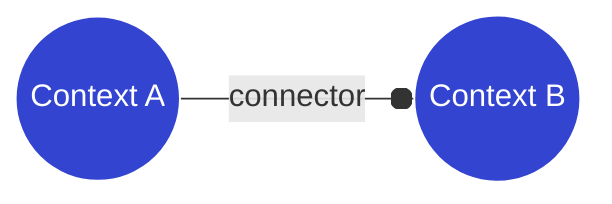

### Data modeling perspective

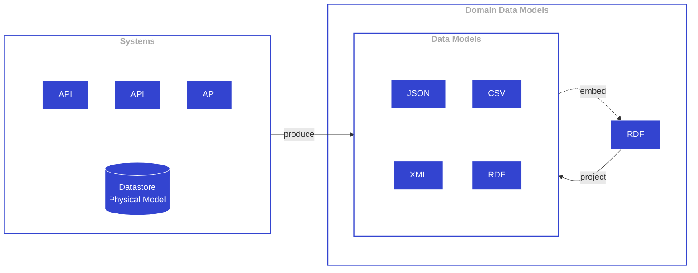

### DDD Experts Architects Public service

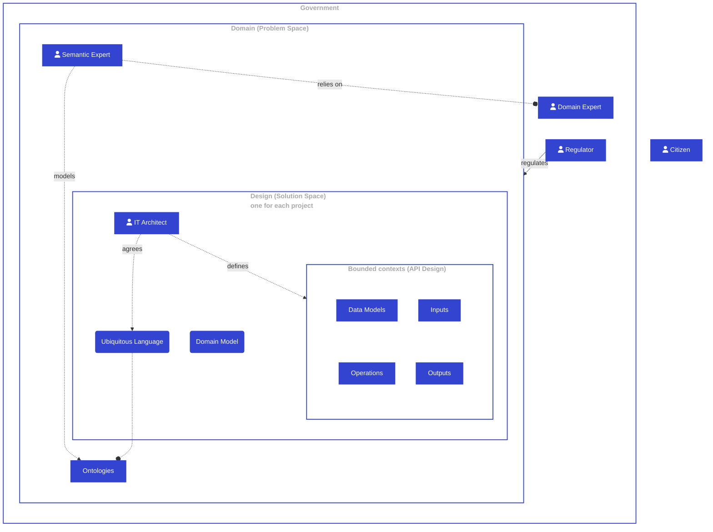

### Sample ontology graph

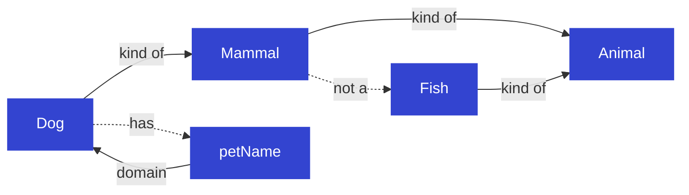

### DDD Experts Architects

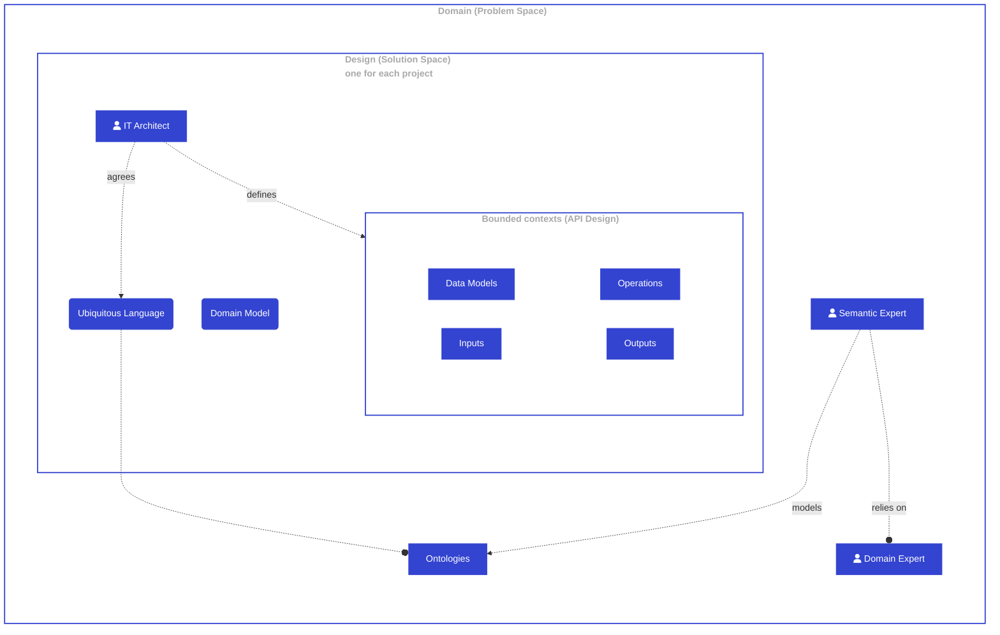

### DDD Public Sector

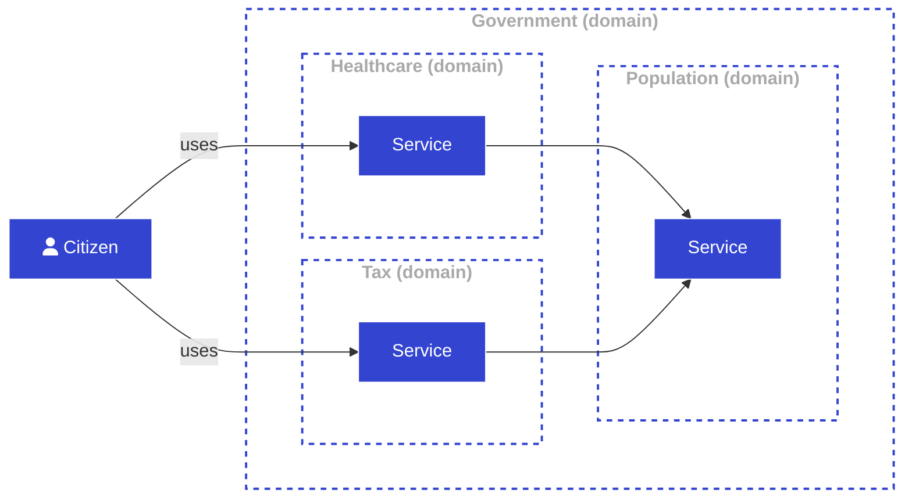

## DDD Flowchart

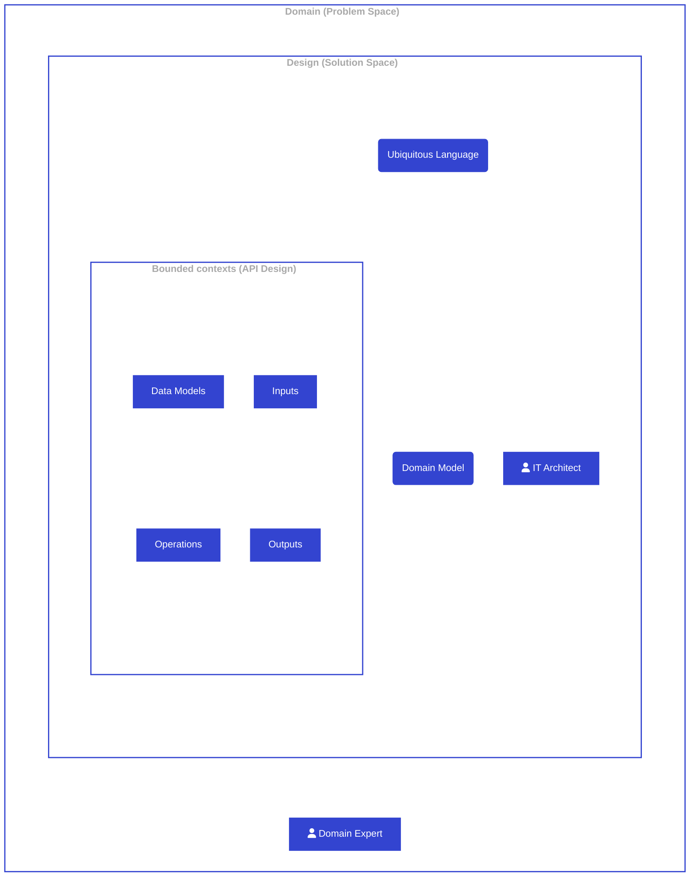

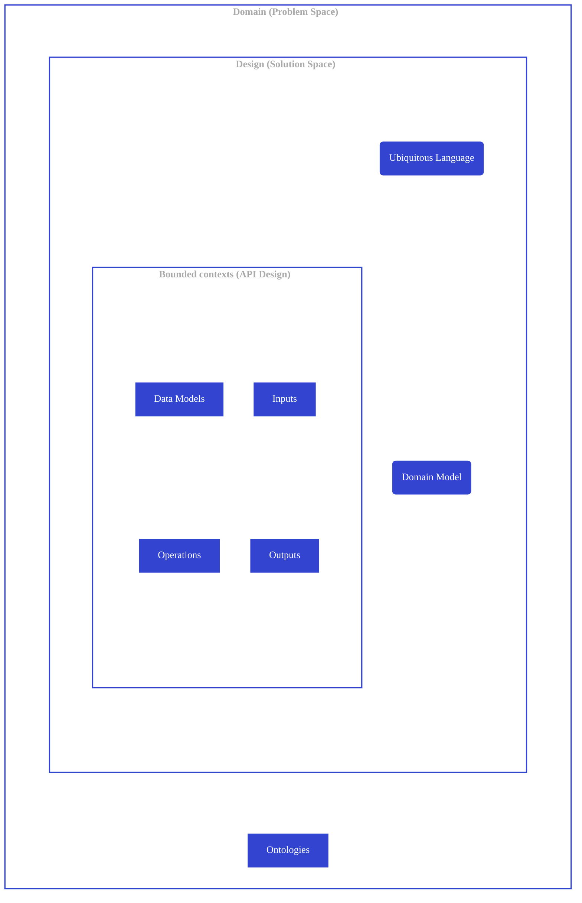

## DDD Context Regulation

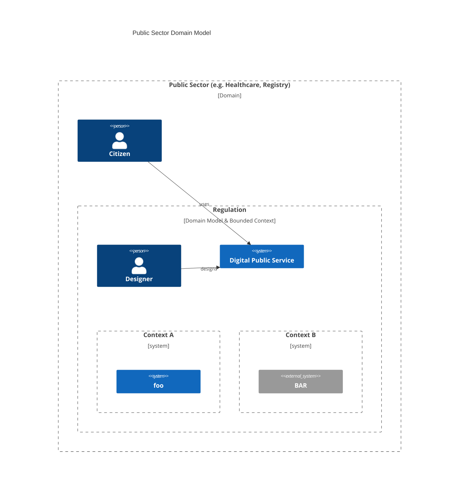
