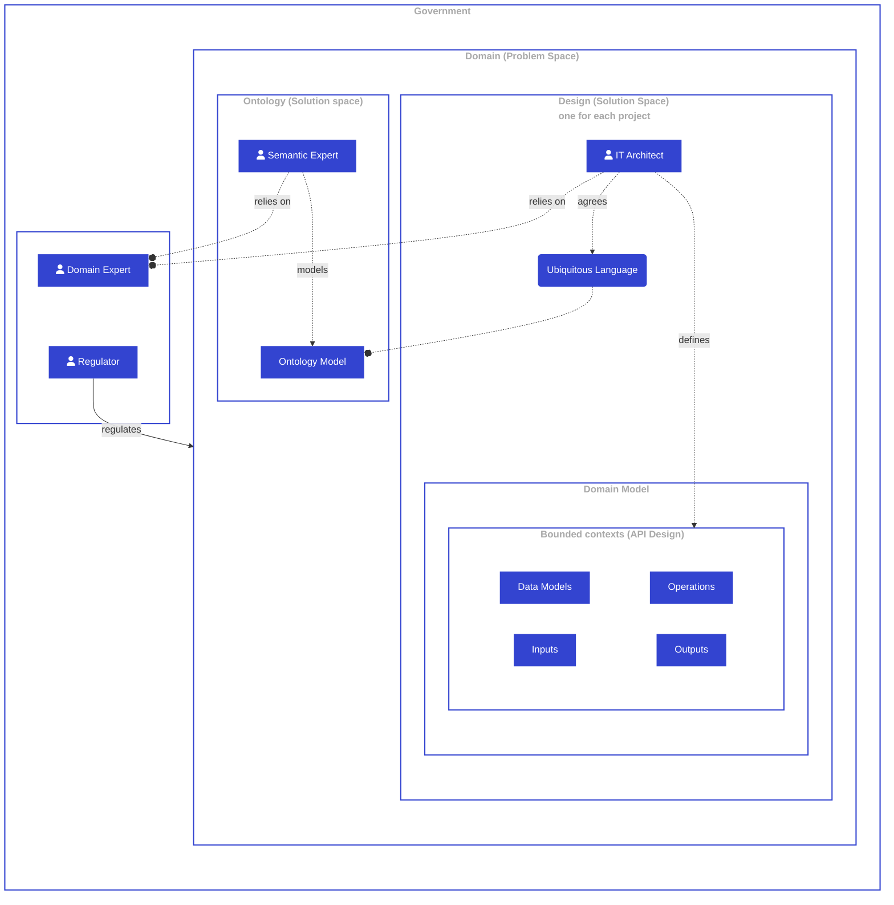

```mermaid
flowchart TD
    classDef default stroke:none,color:#fff,clusterBkg:none,fill:#3344d0
    classDef cluster font-weight: bold,fill:none,color:darkgray,stroke:#3344d0,stroke-width:2px
    classDef subgraph_padding fill:none, stroke:none


    subgraph Ontologies [" Ontology (Solution space)" ]
    S
    OntologyCode[ Ontology Model]
    end

    subgraph BC ["Bounded contexts (API Design) &nbsp;&nbsp; <br>"]
    subgraph Padder2 [ ]
        DataModel[Data Models] ---
        Operations
        Inputs ---
        Outputs
    end
    end

    subgraph DM [Domain Model]
        subgraph P10 [ ]
        BC
        end
    end

    subgraph Sol["Design (Solution Space) &nbsp; <br>one for each project"]


        BC
        subgraph Padder4 [ ]
        direction RL
        T[fa:fa-user IT Architect]
        UL(Ubiquitous Language)
        DM(Domain Model)
        end
        linkStyle 0,1 stroke:none
    end

    subgraph Domain["Domain (Problem Space) &nbsp; <br>"]
        subgraph Padder1 [ ]
        S[fa:fa-user Semantic Expert] -.->|models| OntologyCode
        Ontologies
        Sol
        end
    end

    subgraph Government
        direction TB
        Domain
        subgraph Users [ ]
            R
            D
        end
        subgraph P0 [ ]
        R[fa:fa-user Regulator] -->|regulates| Domain
        D[fa:fa-user Domain Expert] --- R
        end
    end

    T -.-> |agrees| UL
    T -.-o |relies on| D
    T -.-> |defines| BC
    S -.-o |relies on| D
    UL -.-o OntologyCode

    linkStyle 4 stroke:none
    %% Padders avoid overflows in subgraphs.
    class P0,P10,Padder1,Padder2,Padder3,Padder4 subgraph_padding

```
